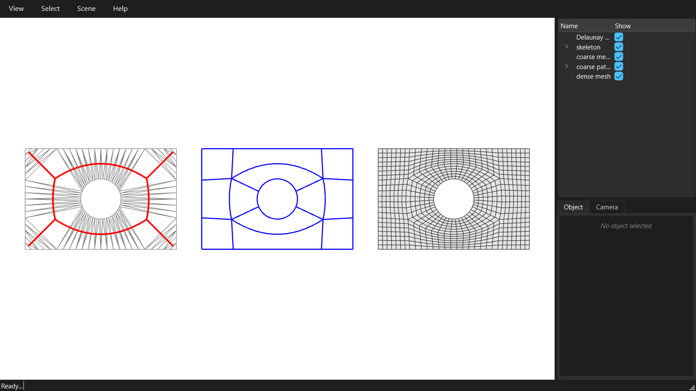

# The basic skeleton workflow

The skeleton route from boundary to dense quad mesh: the medial axis of the domain cuts it into a few large quad patches, and each patch is filled with a grid of quads.



```python
--8<-- "examples/GitHub/01_skeleton_workflow.py"
```
