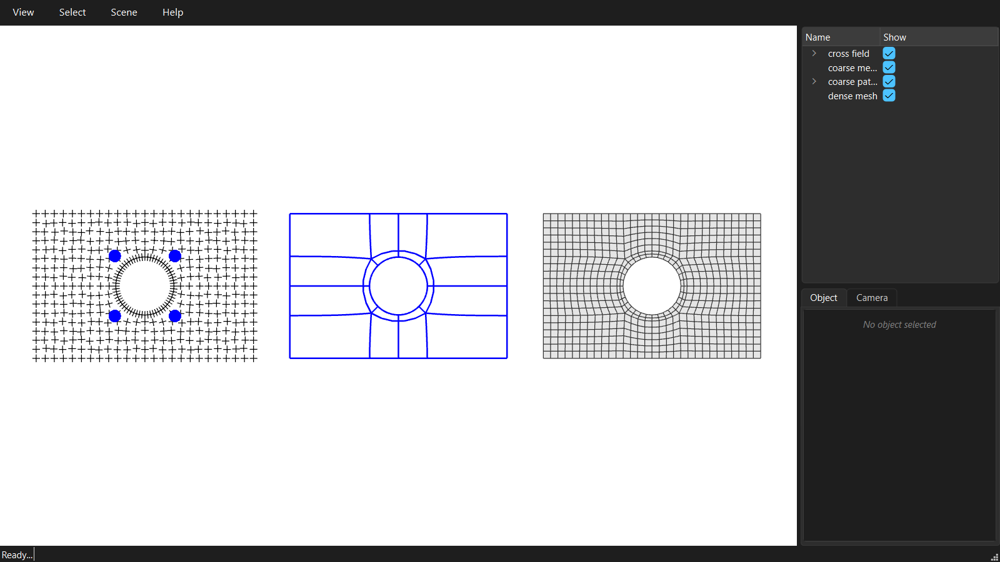

# The basic frame-field workflow

The frame-field route on the same domain: a cross field is solved over it, its singularities become the poles of the quad mesh, and the separatrices traced out of them cut the domain into quad patches.



```python
--8<-- "examples/GitHub/02_framefield_workflow.py"
```
