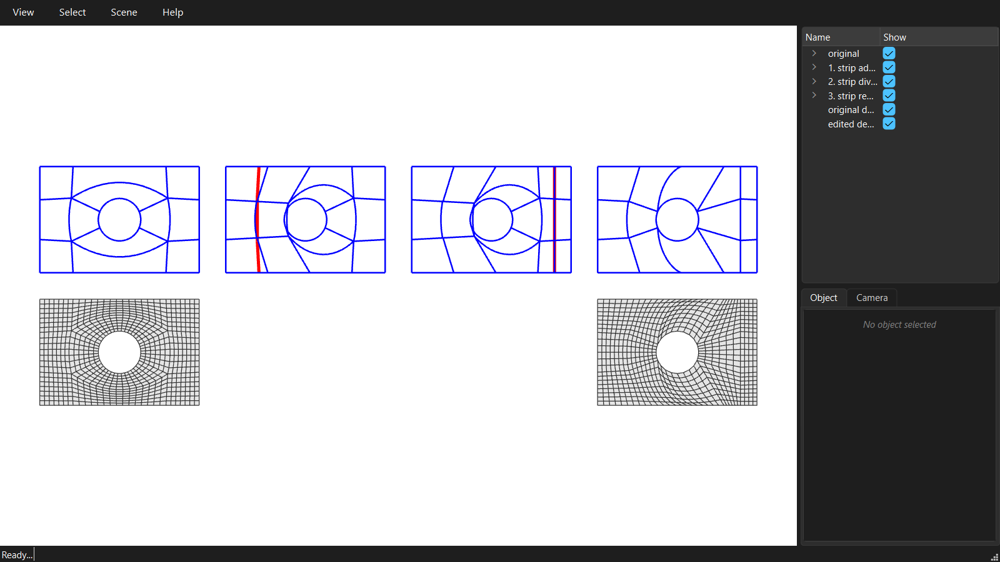

# Editing the coarse quad mesh

The coarse mesh decides the topology of the final quad mesh: where its poles are and which way its quads run. It can be edited before it is densified.



```python
--8<-- "examples/GitHub/03_coarse_mesh_editing.py"
```
