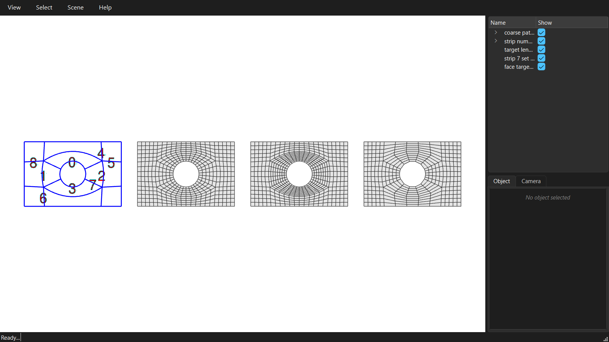

********************************************************************************
Densities
********************************************************************************

.. rst-class:: lead

The density of a strip is the number of quads across it. A strip runs through several patches, and the patches on either side of an edge share it, so setting densities per strip always gives a conforming mesh.

.. literalinclude:: ../../examples/GitHub/04_densities.py
    :language: python
