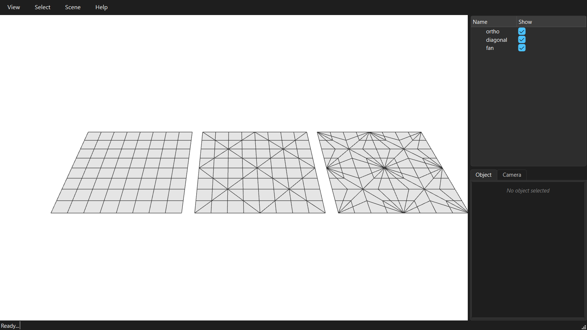

********************************************************************************
Patterns
********************************************************************************

.. rst-class:: lead

Each patch of the coarse mesh can be filled with a different pattern: ``'ortho'``, ``'diagonal'`` or ``'fan'``.

.. literalinclude:: ../../examples/GitHub/05_patterns.py
    :language: python
