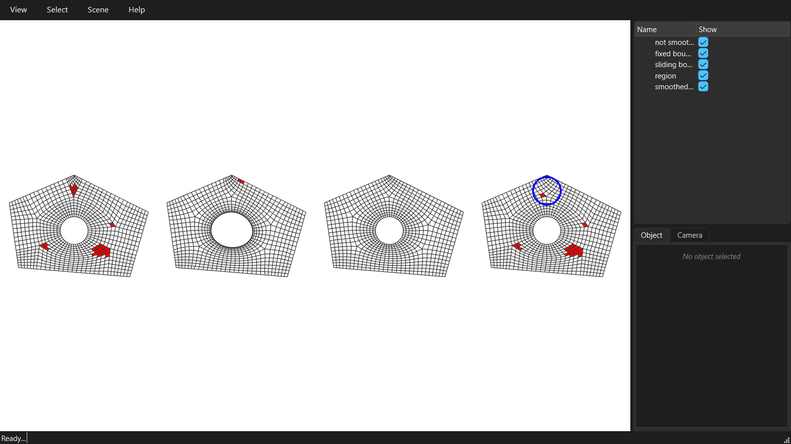

********************************************************************************
Smoothing the quad mesh
********************************************************************************

.. rst-class:: lead

A dense mesh straight from ``densify()`` is made of patches that were each filled on their own, so the quads kink where patches meet. Smoothing moves the vertices to even out the quads, without changing the topology.

.. literalinclude:: ../../examples/GitHub/06_quad_mesh_smoothing.py
    :language: python
