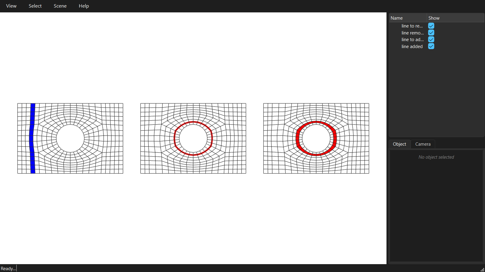

********************************************************************************
Editing the dense quad mesh
********************************************************************************

.. rst-class:: lead

The dense mesh can be edited with the same strip rule as the coarse mesh, one row of quads at a time: a line is removed, or a polyedge is split open into a new line of quads.

.. literalinclude:: ../../examples/GitHub/07_quad_mesh_editing.py
    :language: python
