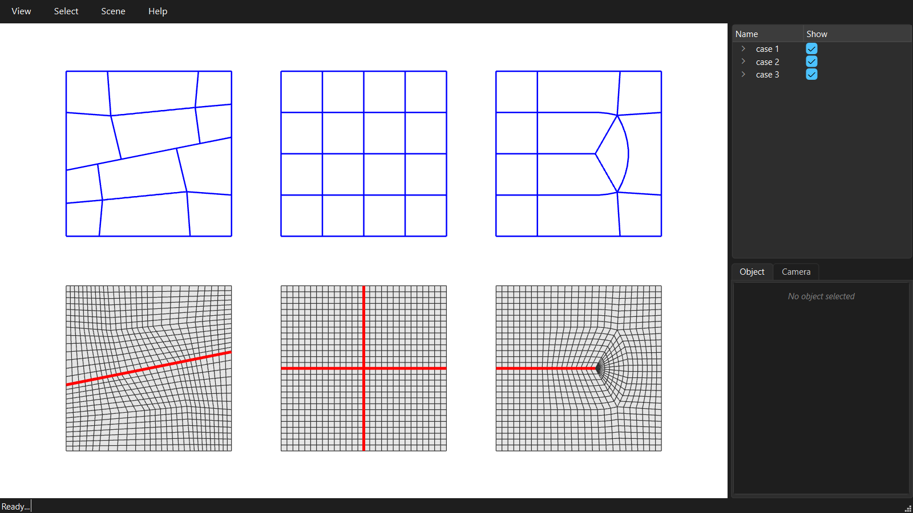

********************************************************************************
Curve features
********************************************************************************

.. rst-class:: lead

A curve feature is a line the quad mesh must follow: a crease, a rib, a joint. The domain is cut open along the line before the skeleton is computed, so the line becomes a row of mesh edges.

.. literalinclude:: ../../examples/GitHub/08_curve_features.py
    :language: python
