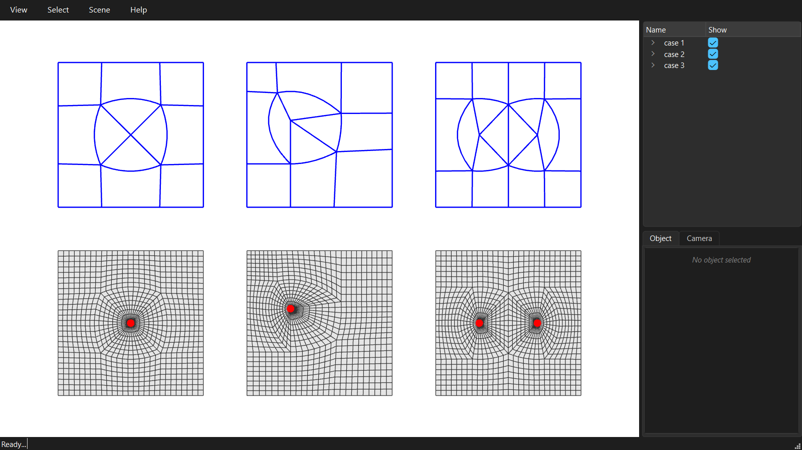

********************************************************************************
Point features
********************************************************************************

.. rst-class:: lead

A point feature is a point the quad mesh must converge to: a POLE. All the mesh lines around it run into that one point, like the meridians of a sphere into its pole. Useful for a column head, an oculus or the apex of a dome.

.. literalinclude:: ../../examples/GitHub/09_point_features.py
    :language: python
