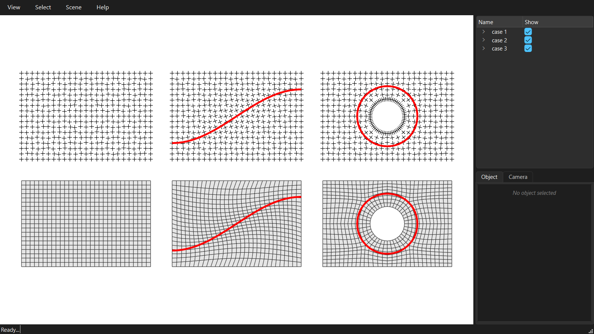

# Guides on the frame-field route

A guide is a curve the quads should run along: a cable, a force line, a direction of span. It is only available on the frame-field route: the cross field is aligned with the guide near it, and the dense mesh follows the field.



```python
--8<-- "examples/GitHub/10_guides.py"
```
