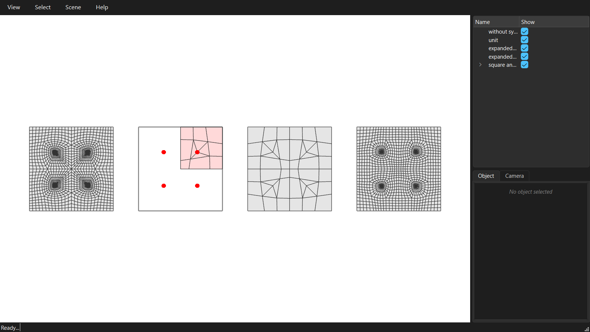

# Symmetry

A symmetric domain does not always give a symmetric mesh: the decomposition can break the symmetry. Meshing one symmetric unit and expanding it by the symmetry group gives a mesh that is symmetric by construction.



```python
--8<-- "examples/GitHub/11_symmetry.py"
```
