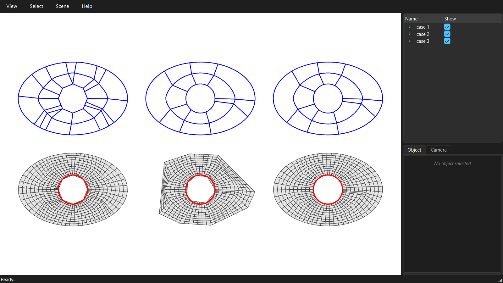

# Curved boundaries

A curved boundary is given as a list of points along it. Its sampling, and whether the coarse edges keep the curve they came from, decide whether the mesh follows it.



```python
--8<-- "examples/GitHub/12_curved_boundaries.py"
```
