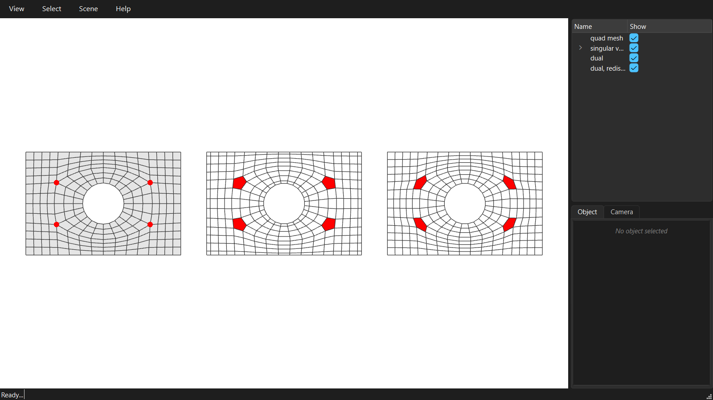

********************************************************************************
From quad mesh to blocks: the dual mesh
********************************************************************************

.. rst-class:: lead

For masonry or other block structures, the quad mesh is read the other way round: each vertex of the quad mesh becomes a block, and each edge a joint between two blocks. That is the DUAL mesh.

.. literalinclude:: ../../examples/GitHub/13_dual_blocks.py
    :language: python
