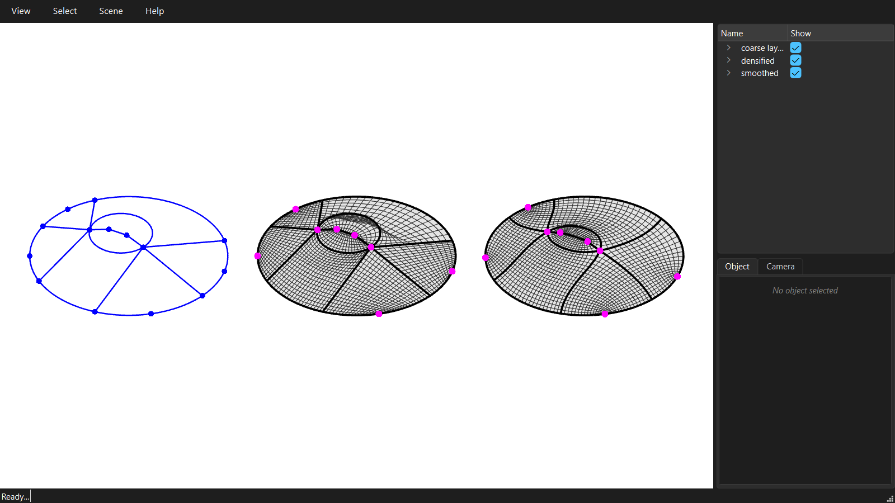

# A hand-made coarse layout

The skeleton decomposition gives one layout per domain. Any other layout can be made by hand: build the coarse quad mesh from its vertices and faces, give its edges their curves, and densify it like any other. This one comes from an old image by Robin Oval: a flat ellipse with a loop around a slit.



```python
--8<-- "examples/GitHub/14_hand_made_layout.py"
```
