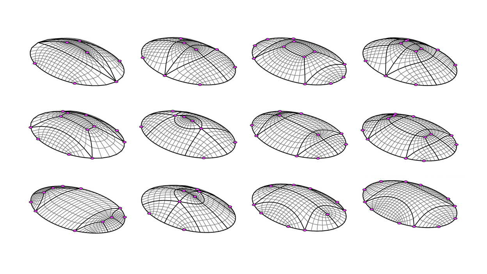

# COMPAS Singular

`compas_singular` turns a 2D domain -- a boundary, optional holes, and optional
point features, curve features and guides -- into a quad mesh with controlled topology.
You choose where the irregular vertices (the *singularities*) sit,
instead of getting them wherever a generic quadrangulation happens to put them.

A coarse quad layout is built from the domain along one of two routes:
the topological skeleton of the domain, or a cross field solved over it.
The layout can then be edited strip by strip, given densities and patterns,
densified into a dense quad mesh, smoothed, and turned into its dual.
The same pipeline runs as a Python API, as a set of Rhino 8 commands, and as an MCP server.

`compas_singular` stems from the doctoral research of Robin Oval,
[*Topology Finding of Patterns for Structural Design*](https://pastel.hal.science/tel-02917467)
(Université Paris-Est, 2019), and is built on the [COMPAS](https://compas.dev) framework.

- [Installation](installation.md)
- [Tutorial](tutorial/index.md): the pipeline, the two routes, smoothing, Rhino and the MCP server
- [Examples](examples/index.md): thirteen short scripts, one feature each, with pictures
- [API Reference](reference/compas_singular.algorithms.md)
