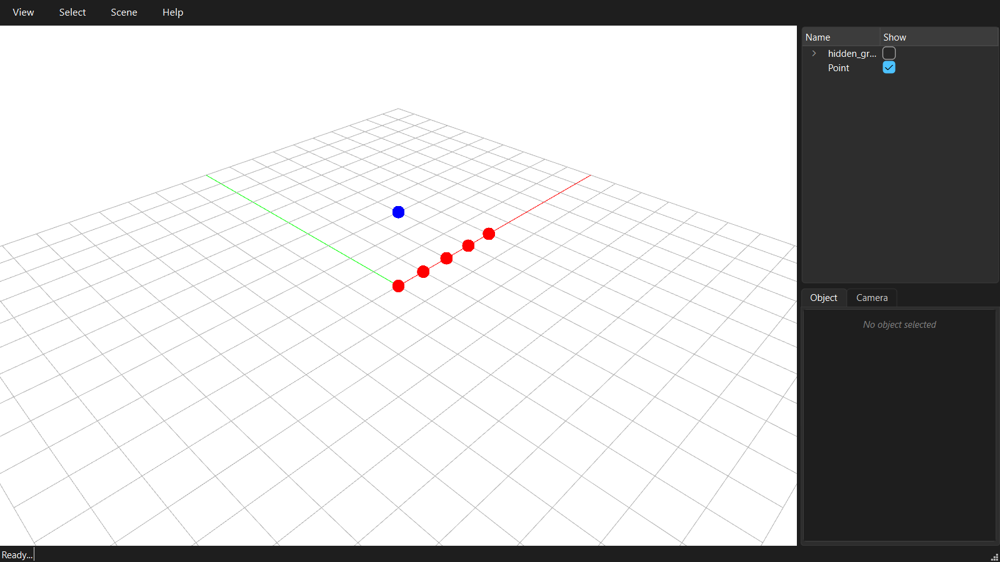
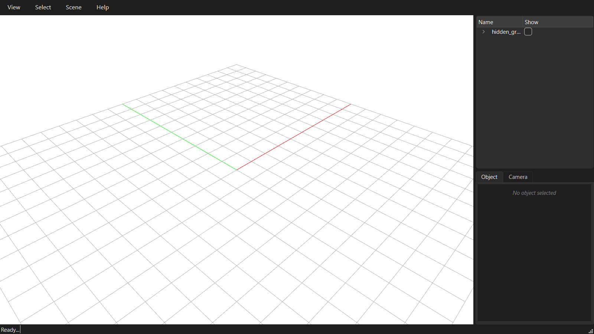
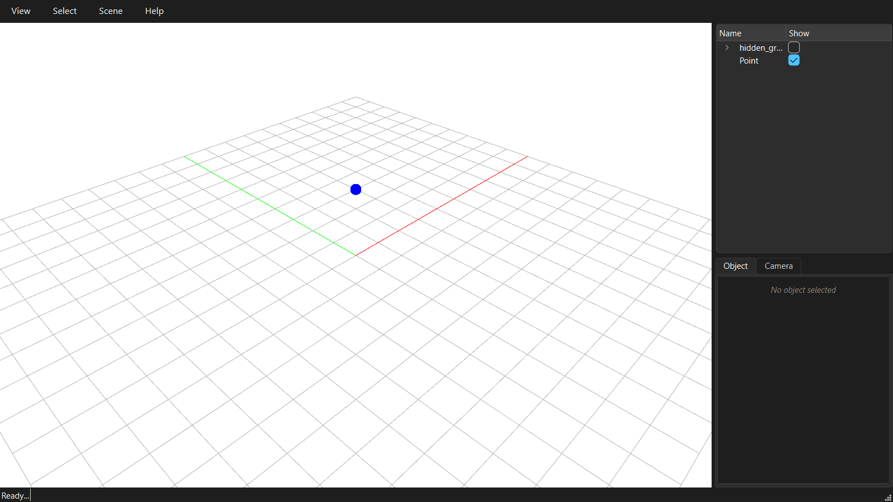

# Group "Show" checkbox stops hiding its children after the viewer is reopened with more elements

Reproduced and fixed against `compas_viewer` 2.0.2. Fix lives in
[`_viewer_patches.py`](../src/compas_singular/_viewer_patches.py).

## Symptom

A `compas_viewer.scene.Group` is used to organize related objects (e.g. one
group per pipeline step, as in `MoreControl copy.py`). Unchecking the group's
row in the sidebar's "Show" column correctly hides all of its children the
first time the viewer is shown.

But once the viewer window is closed and the script adds more elements to the
scene before calling `viewer.show()` again, the group's checkbox no longer
controls its children:

- Toggling it does nothing.
- Worse: children that were already hidden **reappear** on reopen, even
  though the checkbox still shows unchecked.

## Reproduction

Minimal repro: a group of 5 red points with `group.show = False`, shown once,
closed, then one *unrelated* point added anywhere else in the scene via
`viewer.scene.add(...)`, then shown again.

| | |
|---|---|
|  | **1. First `viewer.show()`.** Group is unchecked, all 5 red points are correctly hidden. So far so good. |
|  | **2. After closing, adding one unrelated point, and calling `viewer.show()` again.** The group checkbox is *still unchecked* -- but all 5 red points are back, alongside the new unrelated blue point. The link between the checkbox and the render is broken. |

After applying the fix (below), the same script keeps the group hidden:

| | |
|---|---|
|  | **3. First `viewer.show()`, patched.** Unchanged -- still hidden. |
|  | **4. Reopened after the same unrelated add, patched.** Checkbox unchecked, red points correctly stay hidden. |

## Cause

`compas_viewer` computes per-object visibility on the GPU: the vertex shader
walks a parent-index chain baked into a settings texture and multiplies each
ancestor's `show` value together
(`compas_viewer/renderer/shaders/model.vert`, `getEffectiveShow`). For a
`Group`'s "Show" checkbox to affect its children, the `Group` itself needs a
row in that texture so the children's parent index can point at it.

Two different methods populate the texture, and they disagree on whether
`Group` belongs in it:

- `Renderer.init()` (`compas_viewer/renderer/renderer.py`, runs once, the
  first time the viewport renders) adds every object **except**
  `TagObject` -- `Group` included:

  ```python
  for obj in self.viewer.scene.objects:
      if not isinstance(obj, TagObject):
          self.buffer_manager.add_object(obj)
  ```

- `Renderer.rebuild_buffers()` (same file, runs on every later
  `viewer.scene.add()` / `.remove()` call) excludes `Group` as well:

  ```python
  for obj in self.viewer.scene.objects:
      if not isinstance(obj, (Group, TagObject)):
          self.buffer_manager.add_object(obj)
  ```

`viewer.running` is set to `True` inside `Viewer.show()` and is **never reset
to `False`** when the window closes (`compas_viewer/viewer.py`). So the very
first `viewer.scene.add()`/`.remove()` call made anywhere after the viewer
has ever been shown -- which is exactly what "add more elements, then reopen"
requires -- triggers `rebuild_buffers()`. That call clears the buffer and
rebuilds it *without* any `Group` rows. From that point on every object's
parent index resolves to -1 (no ancestor), so no group's checkbox has any
effect on its children for the rest of the process. This is not really about
"closing and reopening" specifically -- any `scene.add()`/`remove()` call
after the first `show()` triggers it, the reopen pattern is just the most
common way to hit it.

Verified directly: instrumenting `BufferManager.add_object` shows the `Group`
gets a row (`parent_index=0.0` for its children) during the first render, and
gets skipped entirely (children's `parent_index` back to `-1.0`) as soon as
`rebuild_buffers()` runs.

## Fix used here

[`_viewer_patches.py`](../src/compas_singular/_viewer_patches.py) replaces
`Renderer.rebuild_buffers` at runtime with a version whose second loop
excludes only `TagObject`, matching `Renderer.init()`. Call it once, right
after importing `Viewer`:

```python
from compas_viewer import Viewer
from compas_singular._viewer_patches import patch_group_visibility
patch_group_visibility()
```

It's idempotent, so it's safe to call from every example script that uses
groups.

## How this could be fixed in `compas_viewer` itself

The patch above is a workaround; the real fix is a one-line change in
`compas_viewer/renderer/renderer.py`. `rebuild_buffers`'s second loop should
match `init`'s:

```diff
 def rebuild_buffers(self):
     """Rebuild the buffers."""
     GL.glBindVertexArray(self._vao)
     self.buffer_manager.clear()

     # Ensure all objects are initialized before adding to buffer
     for obj in self.viewer.scene.objects:
         if not isinstance(obj, (Group, TagObject)) and not obj._inited:
             obj.init()

     for obj in self.viewer.scene.objects:
-        if not isinstance(obj, (Group, TagObject)):
+        if not isinstance(obj, TagObject):
             self.buffer_manager.add_object(obj)
     self.buffer_manager.create_buffers()
     GL.glBindVertexArray(0)
```

`BufferManager.add_object` already handles objects with no geometry data
gracefully (`Group` has no `_points_data`/`_lines_data`/etc., so the
`hasattr(obj, data_type) and getattr(obj, data_type)` guards in
`_add_buffer_data` simply skip it) -- it only contributes a settings/transform
row, exactly what the parent-index chain needs. No other part of the
rendering pipeline needs to change.

A second, independent inconsistency exists for `TagObject`: `init()` calls
`.init()` on tags but excludes them from the buffer, while `rebuild_buffers`
excludes them from *both* loops -- meaning a `Tag` added after the first
`show()` never gets `.init()` called via this path either. That one is out of
scope for this fix (tags are drawn through a separate code path keyed off
`isinstance(obj, TagObject)`, not the settings-buffer parent chain), but would
be worth checking if tags added post-`show()` ever fail to render.

The ideal upstream fix would also reset `viewer.running = False` when the
window closes, so `viewer.running` actually means "the window is currently
open" rather than "the window has ever been opened" -- but that changes
behavior more broadly (e.g. whether `scene.add()` eagerly rebuilds while the
window is closed at all), so the one-line `rebuild_buffers` fix above is the
minimal, targeted change for this specific symptom.

## Caveats

- Only verified for `Group` visibility. Other settings that ride the same
  parent-index chain (opacity, selection, transform) should benefit from the
  same fix, but weren't specifically re-tested here.
- Doesn't address the separate `TagObject` init inconsistency noted above.
